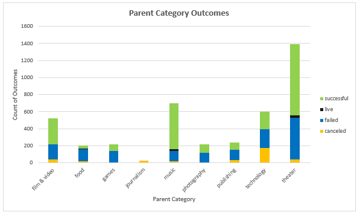
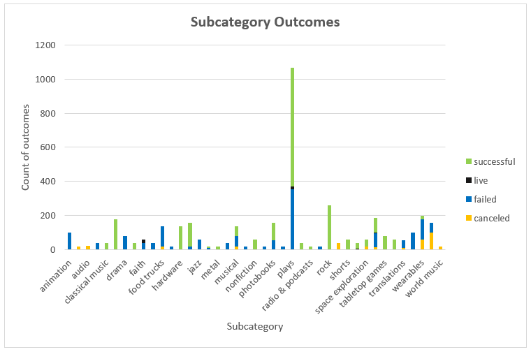
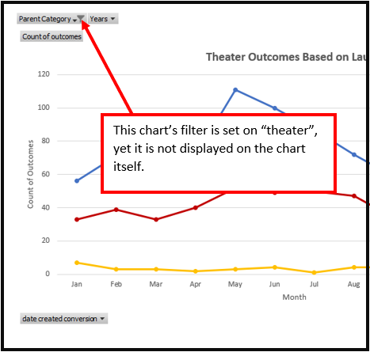

# Analysis of Kickstarter Campaigns
*MS Excel data analysis to uncover trends*

## Project Overview 
### Background
In this project I am performing data analysis for the ***Kickstarter*** crowdfunding campaigns (from the year 2009 to 2017) in order to find trends, patterns or correlations in Kickstarter dataset, and answer the following questions:
- [x] Is there a correlation between time (month of the year) and campaign outcome?
- [x] How successful are campaigns within a certain goal range?
- [x] How successful are theater campaigns compare to other campaigns?
- [x] How successful are theater plays (specifically) compare to other campaigns?
- [x] What can at-a-glance analysis tell us about specific theater plays in GB?
- [x] What measure of central tendency tell us about theater plays in the US? 
- [x] What can quartiles and outliers analysis tell us about musicals in GB?

For this data analysis I am using ***MS Excel*** as a tool, including **interactive pivot tables and charts**, **conditional formatting**, **advanced filters** and various **advanced Excel formulas**.

:heavy_check_mark: All calculations refer to spreadsheets  and  
<kbd>
(Please download the .xlsx files to see the full analysis.)
</kbd>

:large_blue_circle: Headers marked with blue circle are **not** part of the analysis for grading purposes.

### Purpose
The purpose of this analysis is to help playwright Louise with her decisions in applying for the crowdfunding campaign on Kickstarter. Her campaign is a theater play *Fever* at an estimated cost of roughly *$10,000*. She is wondering where she stands with her goal, how successful are campaigns with a similar budget and when is a good time to launch the campaign. She is interested in the US and GB theater market, specifically in plays and musicals respectively; therefore, part of this analysis focuses on those fields as well.

<kbd>
<p align="center">

</p>
</kbd>

```In this report``` :bulb: ```symbol is used to guide Louise’s decision based on this data analysis.```

## Analysis and Challenges
### Analysis of Outcomes Based on Launch Date
In this analysis, I created an interactive pivot table and a line pivot chart that can be filtered by parent category and years. The chart **Theater Outcomes Based on Launch Date** has months on x-axis and count of outcomes on y-axis. I created pivot table and chart from the selection of the entire dataset. Next, I added selected variables by dragging and dropping into chart fields and set up filters on the data that I wanted to drill-down (years and parent category).

From the chart, we can see that May and June are the best months to start the campaign. There were 111 (67%\*) and 100 (65%\*) successful campaigns, respectively. The number of successful campaigns significantly declined in December; only 37 (49%\*) successful campaigns in this month. Moreover, May and June have a higher volume of campaigns, 166 (12%\*) and 153 (11%\*) respectively, while December has the lowest volume of campaigns at 75 (5%\*). Another interesting observation is the overall success rate of theater campaigns at 61%\**.

\* Percentages are calculated from the total campaigns within the same month.

\** Percentage of theater campaigns is calculated from the total campaigns in all categories.

<p align="center">

</p>


:bulb: ```This data analysis can help playwright Louise decide when is a good time to start a campaign. She can plan accordingly in order to increase her chances of success.```


### Analysis of Outcomes Based on Goals
In this analysis, I created a table to count theater plays campaigns based on their outcome and goal range. For calculations, I used `COUNTIFS()` formula, which consists of three conditions `subcategory`, `range`, and `outcome`. Next, I used `SUM()` formula to calculate total projects for each goal range. Additionally, I calculated the corresponding percentages for outcomes and used cell formatting to convert numbers into % and round them to the nearest integer. 

<p align="center">

</p>

The table and chart **Outcomes Based on Goals** reveals which goal range has a higher % of successful campaigns. Campaigns with a goal of less than $1,000 and a goal range between $1,000 to $4,999 have a higher success rate 76% and 73% respectively, while campaigns with the goal above $50,000 have a lower success rate at 13%.


:bulb: ```Louise’s project falls in goal range between $10,000 and $15,000. The success rate in this range is 54%. However, the volume of total campaigns in this range is not very high. Only 72 (7%) campaigns are in this range. For comparison, one range below her budget ($5,000 to $9,999) has a similar success rate at 55%, and the volume at 169 (16%) total campaigns.```

### :large_blue_circle: Other Support Analysis
#### :large_blue_circle: Parent Category Analysis
In this analysis, I used pivot table and interactive stacked column chart that can be filtered by county and it is organized in descending order. **Parent Category Statistic** chart is simple, yet very descriptive and clearly shows how **theater** campaigns stand out against other categories. Theater campaigns have a higher volume of 1393 (34%) campaigns and a high success rate: 893 successful compare to 493 failed campaigns.

<p align="center">

</p>

:bulb: ```Louise can confidently continue with planning for her theater campaign. However, let’s take a closer look at theater plays (specifically) in the next paragraph.```

#### :large_blue_circle: Subcategory Analysis
In this analysis, I used pivot table and interactive stacked column chart that can be filtered by county and by parent category. From the chart, we can see that plays stand out, by volume and by success, with a total of 1066 projects (77%), and a high success rate of 694 successful campaigns compare to 353 failed campaigns.

<p align="center">
  
</p>

This chart has set an additional filter *parent category*. With this **filter**, we can **drill-down** to the information that we are interested in. We can see how plays are performing against other campaigns in the same category. This is very helpful when we want to focus on specific fields – plays in this case.


:bulb: ```This is another good news for playwriter Louise. So far, data analysis tells that Louise is in good standing, since theater plays have positive outcomes compare to other campaigns. Yet, there are some other statistical approaches that can reveal additional information.```

#### :large_blue_circle: V-Look-Up Analysis for Specific Theater Plays in GB
In this analysis, I used `VLOOKUP()` formula. This formula returns matches based on a key value. It is a powerful tool that can quickly find and return numbers of data in an organized table. The link that follows opens .xlsx file (worksheet: Edinburg_Research) where we can find only selected data that we want to focus on.


:bulb: ```In this at-a-glance analysis, Louise can compare her own campaign with the plays she saw at the Edinburg Festival in GB. The table provides a quick look-up about goals and pledges, an average donation, and the number of backers.```

#### :large_blue_circle: Measure of Central Tendency Analysis for US Theater Plays Market
In this analysis, I used **measures of central tendency** to calculate mean and median, and **measures of spread** to calculate standard deviation, lower and upper quartiles, and IQR for US market in theater plays. I compared successful and failed campaigns based on their goals and pledges. Excel has integrated formulas to calculate these measures which make calculations fairly easy. Form the table below we can see the nature of these formulas.

<p align="center">

</p>

- **Mean** in successful campaigns is **lower** ($5,049) than in failed campaigns ($10,554). This information tells that too high of a goal can be one of the reasons why campaigns might fail (campaigns are asking for too much money).
- **High difference between mean** ($10,554) and **median** ($5,000) in failed goals, indicates that distribution is highly skewed, meaning that some extreme values are pulling the mean higher and increasing the gap between mean and median.
- **Low mean and median** in pledged amounts for failed campaigns compare to mean and median in successful campaigns indicates that:

>Failed campaigns are unsuccessful for reasons other than asking for too much money. In other words, if the failed projects were also getting a median pledge amount of around $3,000, it's possible that those that failed just asked for too high of a price. Since the median is much lower, there must be another factor keeping people from pledging to those unsuccessful projects (1). 

- **IQR** ($8,000) of goals in failed campaigns **is 3-times the value of standard deviation** ($21,968), which points to extreme value(s). I used `MAX()` formula to check on the higest value. This formula returns the maximum value of the chosen array, in this case, $180,000.
 
:bulb: ```This analysis is a bit game-changer for Louise’s campaign. The goal for her campaign is set too high, about twice the average of successful campaigns. This fact reduces the possibility for her success.```
 
#### :large_blue_circle: Box and Whiskers (Quartile and Outliers) Analysis for GB Musicals Market
In this analysis I used the Box and Whiskers chart, to find any potential outliers, that might be irrelevant for our analysis. I compared campaign goals and pledges. Excel offers great tools for creating this plot. The first step is selecting data we want to analyze from the dataset, next is to find a “Box and Whiskers” plots in Insert Tab and finally make any changes to the plot. 

<p align="center">

</p>

From the plot we can read the following information:
- Goal median is at £2,000 and indicates that 50% of campaigns are below this value.
- Goal mean is at £4,000 and outside of IQR of amount pledged at £3,000.
- The lower quartile of pledges lays on y-axis and indicates that 25% of those campaigns did not get any fundings.

:bulb: ```Louise is interested in GB Musicals for her future campaign. She estimated cost of her future campaign at £4,000. This analysis shows that she has better chances if she reduces her goal to around £2,000.```

### Challenges and Difficulties Encountered
I found the written part of the analysis the most challenging. I realized that takes a lot of time and effort to tell a meaningful story and to write a clear, easy-to-understand analysis report. Yet it is very rewarding at the end. I encountered some technical problems as well, but luckily the “coding” community is very active and very helpful. Searching for technical support on **@StackOverflow**, **@BSC Lessons**, and **@Slack** made this part much easier and I was able to overcome those challenges. 

#### Written Report and Understanding Data
Writing this report was my biggest challenge. I believe communication is very important and the work I did would have very little value if I couldn’t share it with others throughout this report. I really wanted to have a good start so I devoted extra time, re-read lessons and pre-work, and looked for information in external articles. Another important part is understanding the data I was working with. I would like to highlight a piece of advice that I came across in modules: 

> familiarize yourself with it [data] and get a sense of what you're working with (2).

It seems pretty straight-forward advice but really made the analysis much easier. Besides this, I also asked myself questions such as *What do I want to tell with this analysis? Do I understand the data, results, charts and tables? What this information is telling me? Is this information relevant or rather confusing?* to keep me on the right path.

#### Markdown Language
I wrote a report in Word document, transferred to README.md file, and hoped it will work. Soon, I learned that this is not a case. At first, I struggled with markdown language, in order to get things right and visually pleasing. After a few trials and errors, I started noticing progress. I was surprised at how much I could do with it. One thing led to another. At first, I learned how to include a picture in the text, then I wanted this picture to be in the center and then I wanted to be the right size and so on (and of course :smiley: - emojis!). With every new correction, I learned something new and that was an exciting part! I also learned that markdown language is somewhat similar to HTML that I would like to learn as well! This motivation and rewarding results had helped me overcome this challenge.

#### Sorting Pivot Chart and Table by Descending or Ascending Order
I was familiar with sorting rows in the spreadsheet but was unfamiliar with this feature in pivot tables and charts. At first, I thought that was not possible for pivot tables and charts. Thanks to the lecture I learned that I can sort pivot tables and charts and was surprised how organized and clean the visualization looked by applying this feature.

<p align="center">

</p>

#### Conditional Formatting
I had some basic knowledge of conditional formatting, yet I learned I was doing it "long-way". If I wanted to make corrections I would go back to setting and rewrite the rules. Spending some time on conditional formatting I noticed a very convenient button `manage rules`. It can be found in Home Tab -> Conditional Formatting drop-down menu -> Manage Rules. It was a bit of a game-changer for me. Now I am able to manage conditional formatting rules more efficiently.

<p align="center">

</p>

## Results
### Conclusions about the Theater Outcomes based on Launch Date
- [x] May and June have 111 (67%) and 100 (65%) successful campaigns respectively.
- [x] December has 37 (49%) successful campaigns.
- [x] May and June have a total of 166 (12%) and 153 (11%) campaigns, respectively.
- [x] December has a total of 75 (5%) campaigns.
- [x] Overall success rate of theater campaigns is 61%.

:heavy_check_mark: Campaigns launched in May and June has a higher success rate than campaigns launched in December.

:heavy_check_mark: More campaigns are launched in May and June than in December.

### Conclusions about the Outcomes based on Goals for Theater Plays
- [x] Campaigns with a set goal under $1,000 have a 76% success rate.
- [x] Campaigns with a set goal between $1,000 to $4999 have a 73% success rate.
- [x] Campaigns with a set goal of over $50,000 have a 13% success rate.
- [x] 96% of all campaigns are under a set goal of $25,000.
- [x] 4% of all campaigns are above a set goal of $25,000.

:heavy_check_mark: Campaigns with a set goal under $1,000 has higher success rate than campaigns with a set goal over $50,000.

:heavy_check_mark: There are significant more campaigns with a set goal under $25,000 than campaigns above $25,000.

### Limitations of the dataset
:exclamation:This dataset -- .xlsx or Excel file -- is a *flat-file* and is mainly used for preparatory data analysis and visualization. It is a great tool indeed since doesn’t require a specific query language to retrieve data, it is widely used and easy to learn. Excel is also very versatile since covers many fields of the data pipeline: exploratory data analysis, data validation, data visualization, and data analysis. These are great aspects but have some drawbacks as well. As mentioned above, Excel is a *flat-file* and by definition, a flat-file is a file where data is separated by commas or tabs, with one record per line without internal hierarchy (3); therefore, those files are not meant for deeper analysis rather for ‘at-a-glance summary metrics’ (4). 

:exclamation:Excel files are easy to duplicate, and it is done more than has to be, what can lead to inaccuracy and referring to outdated data. Duplicates and multiple versions of datasets are one of the biggest issues of data accuracy.

:exclamation:Multiple access problem. Excel files are inconvenient when multiple people need to work on the same excel file at the same time.

:exclamation:Not suitable for a large amount of data. Excel has limitation of 1,048,576 rows and 16,384 XFD columns.
 
:exclamation:Selected filter is not displayed on the pivot chart itself.

<p align="center">

</p>

If the chart is missing or lacking a descriptive title, especially when we save Pivot charts in separate directories apart from corresponding pivot tables, visualization can be misleading. 
 
### Recommendations for additional tables and graphs

:pushpin: Using data bars. 

<p align="center">

</p>
          
Using data bars on tables gives us at-a-glance analysis and we can easily see what data stands out.

:pushpin: Pivot tables and charts with additional filters.
Adding an additional filter to a table, for example, *Theater outcome based on launch date* (see the table at the beginning of this report) would enable easy comparison of selected categories by country.

:pushpin: Additional analysis in order to find more patterns and trends, for example:
- Correlation between the length of campaigns (launched date vs. deadline to outcome) and their outcome.
- Correlation between backers count, average donation and campaign outcome.

:pushpin: Pie charts and dot charts. We could use those charts for data that contain less information (2-3 different proportions of a whole). An example for pie chart would be *theater plays outcome chart*. 

## References
(1)    “Module 1: Kickstarting with Excel., Measures of Central Tendency”, https://courses.bootcampspot.com/courses/200/pages/1-dot-5-1-measures-of-central-tendency?module_item_id=57341, Trilogy Education Services, 2000. Web 15 Jul 2020.)

(2)    “Module 1: Kickstarting with Excel.” https://courses.bootcampspot.com/courses/200/pages/1-dot-2-2-initial-look-at-the-data?module_item_id=57314, Trilogy Education Services, 2000. Web 14 Jul 2020.

(3)    “Module 1: Kickstarting with Excel.” https://courses.bootcampspot.com/courses/, Trilogy Education Services, 2000. Web 14 Jul 2020.

(4)    “Flat File.” https://www.techopedia.com/definition/25956/flat-file, n.d., n.p., Web 14 Jul 2020.

### :large_blue_circle: Additional useful articles

- [Understanding Quartiles](https://www.investopedia.com/terms/q/quartile.asp#:~:text=First%20quartile%3A%20the%20lowest%2025,the%20highest%2025%25%20of%20numbers)
- [Outliers](https://medium.com/mytake/why-1-5-in-iqr-method-of-outlier-detection-5d07fdc82097)
- [IQR](https://www.thoughtco.com/what-is-the-interquartile-range-rule-3126244)

 

